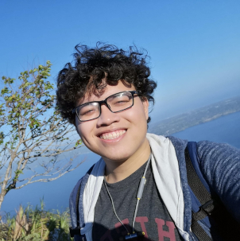

# Hi! I'm J.M. Ebia

---

{ align=left }

## What I do
By day, I build full-stack web apps — architecting databases, forging backends, and shaping clean frontends. I approach code as a system of moving parts, something to understand, optimize, and continually improve through experimentation and iteration.

By night, I dive into the creative side of computing: designing indie games in Godot, tinkering with algorithms and mechanics, and occasionally illustrating just because it feels good to make things.

When I’m off the keyboard, I’m usually hanging out with my beagle or diving into tabletop and video games.

---

## More about me

-   __:octicons-code-square-24: Projects__

    ---

    Check out my featured projects!
    
    [:octicons-arrow-right-24: Go to Projects](/projects).

-   __:octicons-book-24: Curriculum Vitae__

    ---

    Interested in seeing my professional background? You can find my C.V. in the link below!

    [:octicons-arrow-right-24: Check out C.V.](/cv)

---

## Contact and Socials

You can shoot me a message at my work email, or feel free to follow / check me out on any of my socials below:

- :fontawesome-brands-github: [__GitHub__](https://github.com/jmebia) 
- :fontawesome-brands-linkedin: [__LinkedIn__](https://www.linkedin.com/in/jmebia/)
- :fontawesome-brands-itch-io: [__Itch.io__](https://maiusebi.itch.io/)
- :fontawesome-solid-paper-plane: [__hello@jmebia.com__](mailto:hello@jmebia.com)

